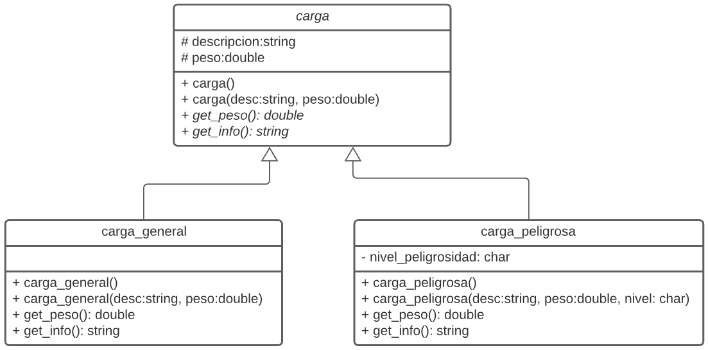

# PC #3 - 2020-2 - Lab 108

Practica Calificada # 3 del curso de Programación Orientada a Objetos 1

## Indicaciones Especificas
- El tiempo límite para la evaluación es 100 minutos.
- Las preguntas deberá ser respondida en un archivo fuente (`.cpp`) y un archivo cabecera (`.h`) con el número de la pregunta:
    - `p1.cpp, p1.h`
- Deberás subir estos archivos directamente a [www.gradescope.com](https://www.gradescope.com) o se puede crear un `.zip` que contenga todos ellos y subirlo.

## Competencias
- Para los alumnos de la carrera de Ciencia de la Computación
    - Aplicar conocimientos de computación y de matemáticas apropiadas para la disciplina. **(Evaluar)**
    - Analizar problemas e identificar y definir los requerimientos computacionales apropiados para su solución. **(Usar)**
    - Utilizar técnicas y herramientas actuales necesarias para la práctica de la computación. **(Usar)**

- Para los alumnos de las carreras de Ingeniería
    - Capacidad de aplicar conocimientos de matemáticas **(nivel 3)**
    - Capacidad de aplicar conocimientos de ingeniería **(nivel 2)**
    - Capacidad para diseñar un sistema, un componente o un proceso para satisfacer las necesidades deseadas dentro de restricciones realistas. **(nivel 2)**

## Ejercicio #1 - Contenedor

### Problem Statement


Escribir un programa que utilizando la clase **`carga`** y sus clases derivadas **`carga_general y carga_peligrosa`** genere un vector polimorfico, que permita almacenar **`n`** cargas, ingresando su tipo (G=General y P=Peligrosa) su descripción, peso y en caso de carga peligra su nivel de peligrosidad (A=Alta, M=Mediana y B=Baja), el programa debe de retornar el peso total de peso, para lo cual el resultado debe obtenerse utilizando el operador sobrecargado **`<<`** (ver diagrama)  :



### Input Format
```bash
    7
    G Carga1 10
    G Carga2 5
    P Carga3 2 A
    G Carga4 5
    P Carga5 2 M
    G Carga6 5
    P Carga7 2 B
```

### Constraints
```bash
- No utilizar etiquetas
- Numeros enteros
```

### Output Format
```bash
    Carga1 10
    Carga2 5
    Carga3 2 A
    Carga4 5
    Carga5 2 M
    Carga6 5
    Carga7 2 B
    Total = 31
```
